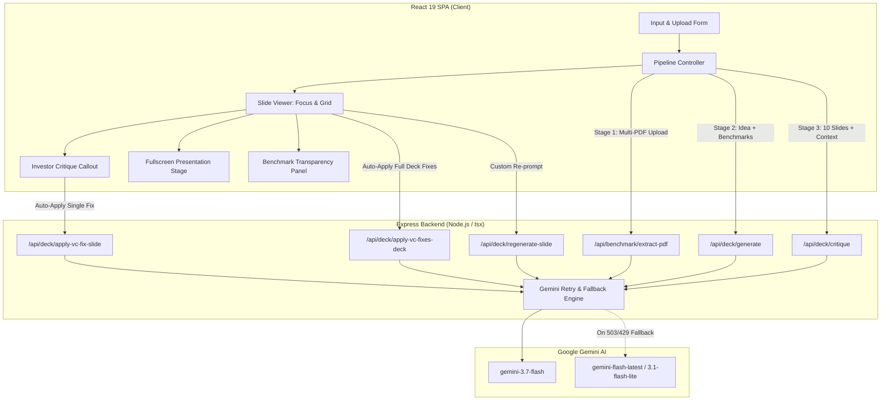

# PitchBench 🚀

> **Ground truth pitch deck generation & institutional VC stress-testing powered by Gemini 3.7 Flash.**

**PitchBench** turns raw business ideas into benchmarked, investor-ready 10-slide pitch decks grounded in real reference pitch decks. It validates every market claim (TAM/SAM/SOM, traction baselines, asking valuations) against real dataset benchmarks, simulates skeptical venture capitalist pushback, and provides single-click AI auto-fixes for individual slides and entire pitch decks.

---

## 📑 Table of Contents

- [Key Features](#-key-features)
- [System Architecture](#-system-architecture)
- [Data Flow & Pipeline Lifecycle](#-data-flow--pipeline-lifecycle)
- [Technology Stack](#-technology-stack)
- [API Reference](#-api-reference)
- [Repository & File Structure](#-repository--file-structure)
- [Getting Started](#-getting-started)
  - [Prerequisites](#prerequisites)
  - [Environment Variables](#environment-variables)
  - [Installation & Development](#installation--development)
  - [Production Build](#production-build)
- [Design Philosophy](#-design-philosophy)

---

## ⚡ Key Features

1. **3-Stage Sequential Grounding Pipeline**:
   - **Stage 1 (Document Extraction)**: Ingests reference pitch deck PDFs and extracts structured market metrics, TAM/SAM/SOM ranges, traction milestones, and funding stages via native multimodal PDF document understanding.
   - **Stage 2 (Deck Generation)**: Drafts a complete 10-slide narrative arc grounded strictly in the reference dataset metrics and typical industry valuations.
   - **Stage 3 (Skeptical VC Critique)**: Acts as a Silicon Valley institutional partner analyzing weak claims, aggressive growth assumptions, and structural gaps with high/medium/low severity scoring.

2. **Grounded Numeric Claims Validation**:
   - Every slide with numeric projections compares figures against industry benchmarks.
   - Flags whether metrics (TAM, churn, CAC/LTV, growth rate) fall within realistic ranges or act as outliers.

3. **Intelligent AI Investor Fix Engine**:
   - **Single Slide Auto-Fix**: Seamlessly integrates VC defense strategies, risk mitigations, and metric validations directly into slide copy and updates critique status.
   - **Deck-Wide VC Optimization**: Re-evaluates and holistically rewrites all 10 slides simultaneously to build a bulletproof narrative across the entire pitch.

4. **Interactive Slide Studio & Presentation Mode**:
   - Focus Mode with real-time text editing, headline customizer, and grounded claim tags.
   - 10-Slide Overview Grid with quick critique status indicators.
   - Fullscreen keyboard-navigable presentation stage (`←` / `→`).
   - Markdown and JSON export capabilities for instant sharing.

5. **Built-in Reference Dataset**:
   - Ships with curated Seed/Series A sample benchmarks across AI, FinTech, SaaS, Healthcare, and B2B Commerce.
   - Supports dragging and dropping custom PDF pitch decks with live parsing.

---

## 🏗 System Architecture



---

## 🔄 Data Flow & Pipeline Lifecycle

```
[ Founder Input & Reference PDFs ]
                │
                ▼
   ┌───────────────────────────┐
   │ 1. PDF Parsing & Schema   │  ──▶ Multimodal document parsing extracts:
   │    Benchmark Extraction   │      TAM/SAM/SOM, traction metrics, funding stages
   └───────────────────────────┘
                │
                ▼
   ┌───────────────────────────┐
   │ 2. 10-Slide Deck Gen      │  ──▶ Enforces standard 10-slide investor structure:
   │    Grounding against Data │      Problem, Solution, Market, Product, Business Model,
   └───────────────────────────┘      Traction, Competition, Go-To-Market, Team, Ask
                │
                ▼
   ┌───────────────────────────┐
   │ 3. VC Pushback Critique   │  ──▶ Skeptical VC evaluation per slide:
   │    & Severity Assessment  │      Concerns, defense fixes, and severity tags
   └───────────────────────────┘
                │
                ▼
   ┌───────────────────────────┐
   │ 4. Interactive Slide Deck │  ◀── Founder edits inline, presents fullscreen,
   │    & Automated VC Fixes   │      or triggers single/bulk AI defense rewrites
   └───────────────────────────┘
```

---

## 🛠 Technology Stack

### Frontend
- **Framework**: React 19 with TypeScript
- **Bundler / Tooling**: Vite 6, Tailwind CSS v4 (`@tailwindcss/vite`)
- **Animation**: Motion (`motion/react`)
- **Icons**: Lucide React (`lucide-react`)
- **Typography & Styling**: Clean Minimalist monochrome aesthetic with high-contrast serif accents

### Backend & Server
- **Server**: Node.js with Express 4
- **TypeScript Runner**: `tsx` (development), `esbuild` (production bundling to CommonJS `dist/server.cjs`)
- **Resilience**: Exponential backoff retry engine with fallback model routing for transient 503/429 high-demand spikes

### AI Integration
- **SDK**: Official `@google/genai` SDK
- **Primary Model**: `gemini-3.7-flash`
- **Output Enforcement**: Strict JSON Schema outputs (`responseMimeType: "application/json"`, `responseSchema`)
- **Multimodal Capabilities**: Native inline PDF document understanding (`application/pdf`)

---

## 🔌 API Reference

| Endpoint | Method | Description |
| :--- | :--- | :--- |
| `/api/health` | `GET` | Server status and Gemini API connectivity check |
| `/api/benchmark/extract-pdf` | `POST` | Ingests PDF files as base64 and returns structured `BenchmarkDeck` metadata |
| `/api/deck/generate` | `POST` | Synthesizes a 10-slide deck grounded against reference benchmark data |
| `/api/deck/critique` | `POST` | Simulates skeptical VC review, generating objections and fixes per slide |
| `/api/deck/regenerate-slide` | `POST` | Re-drafts an individual slide with optional founder custom instructions |
| `/api/deck/apply-vc-fix-slide` | `POST` | Rewrites a single slide by resolving its specific VC critique and updates risk severity |
| `/api/deck/apply-vc-fixes-deck` | `POST` | Holistically rewrites all 10 slides resolving all flagged concerns simultaneously |

### Example Payloads

#### `POST /api/deck/apply-vc-fix-slide`
```json
{
  "slideNumber": 3,
  "currentSlide": {
    "slide_number": 3,
    "slide_name": "Market Size & Opportunity",
    "headline": "A $45B Underserved Market",
    "detailed_content": "TAM is estimated at $45B globally...",
    "numeric_claims": []
  },
  "critique": {
    "slide_number": 3,
    "concern": "Top-down TAM figure lacks bottom-up arithmetic verification.",
    "suggested_fix": "Provide bottom-up formula: 150K target enterprises × $30K ACV = $4.5B SAM."
  },
  "businessIdea": "AI-powered clinical trial recruiting",
  "targetAudience": "Biopharma Sponsors",
  "industryVertical": "HealthTech",
  "benchmarks": []
}
```

---

## 📁 Repository & File Structure

```
├── .env.example                # Example environment variables template
├── metadata.json               # Platform configuration and capabilities
├── package.json                # Dependencies, build, and runtime scripts
├── server.ts                   # Express backend & Gemini API pipeline routes
├── tsconfig.json               # TypeScript compiler configuration
├── vite.config.ts              # Vite & Tailwind CSS build configuration
├── index.html                  # Client HTML root entry
└── src/
    ├── main.tsx                # React DOM root entry
    ├── App.tsx                 # Core application controller & workflow state
    ├── index.css               # Global styling and Tailwind imports
    ├── types.ts                # Shared TypeScript models (Slides, Critiques, Benchmarks)
    ├── data/
    │   └── sampleBenchmarks.ts # Pre-loaded benchmark reference decks
    └── components/
        ├── Header.tsx                 # Navigation bar, status badges, and sample deck triggers
        ├── InputForm.tsx              # Business idea, audience, industry, and PDF file dropzone
        ├── PipelineProgress.tsx       # Live 3-stage visual execution progress indicator
        ├── SlideViewer.tsx            # Slide editor (Focus & Grid views, Deck VC Optimization)
        ├── InvestorCritiqueCard.tsx   # Per-slide VC concern, recommendation, and auto-apply fix
        ├── BenchmarkSummaryPanel.tsx  # Grounding transparency dashboard (TAM/SAM/SOM baselines)
        ├── PresentationModal.tsx      # Fullscreen pitch presentation mode
        └── SampleDecksModal.tsx       # Dataset inspector displaying reference deck metrics
```

---

## 🚀 Getting Started

### Prerequisites
- Node.js `v18.0.0` or higher
- npm, yarn, or pnpm
- Google Gemini API Key ([Get an API key from Google AI Studio](https://aistudio.google.com/))

### Environment Variables
Copy `.env.example` to `.env` and provide your Gemini API key:

```bash
cp .env.example .env
```

```env
GEMINI_API_KEY=your_gemini_api_key_here
```

### Installation & Development

1. **Install dependencies**:
   ```bash
   npm install
   ```

2. **Start the development server**:
   ```bash
   npm run dev
   ```
   The dev server boots on `http://localhost:3000` with hot TypeScript server reloading and Vite client middleware.

### Production Build

1. **Compile frontend and backend bundle**:
   ```bash
   npm run build
   ```
   This builds static client assets into `dist/` and bundles `server.ts` into `dist/server.cjs` via `esbuild`.

2. **Start production server**:
   ```bash
   npm run start
   ```

---

## 🎨 Design Philosophy

PitchBench follows the **Clean Minimalism** design system:
- **High-Contrast Canvas**: Soft `#FAFAFA` neutral surface with sharp `zinc-200` micro-borders and crisp white cards.
- **Typographic Rigor**: Serif display headlines paired with clean, accessible sans-serif body copy and monospace data indicators.
- **Direct Utility**: No artificial animations or marketing distractions—instant access to the pitch pipeline, inline editable fields, and transparency dashboards.

---

## 📄 License

This project is open-source under the [MIT License](LICENSE).
